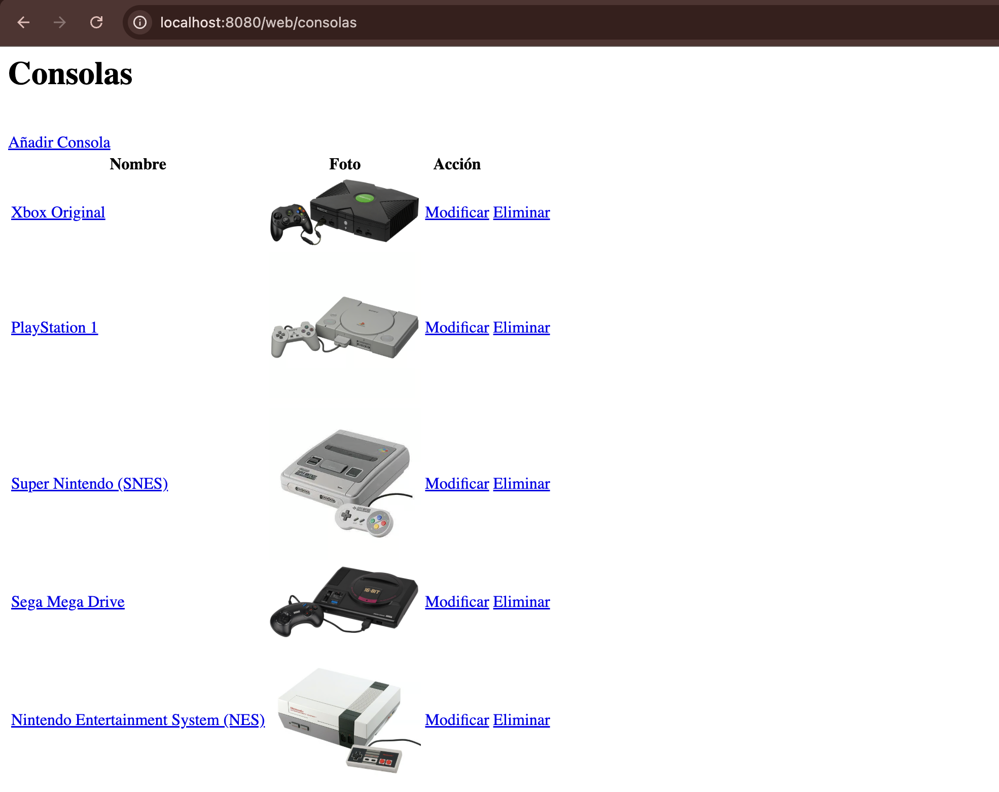
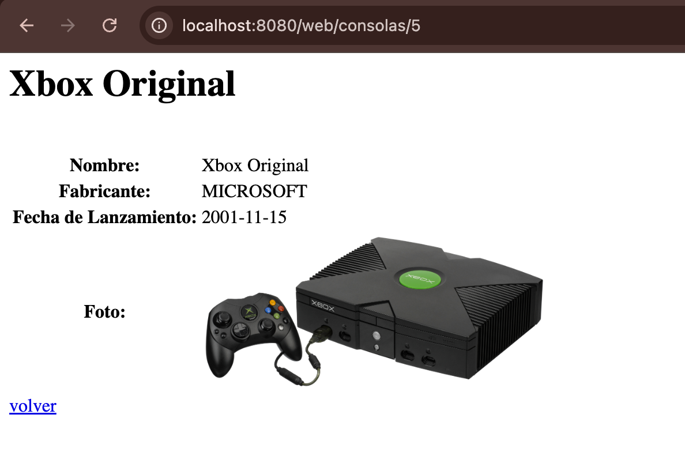
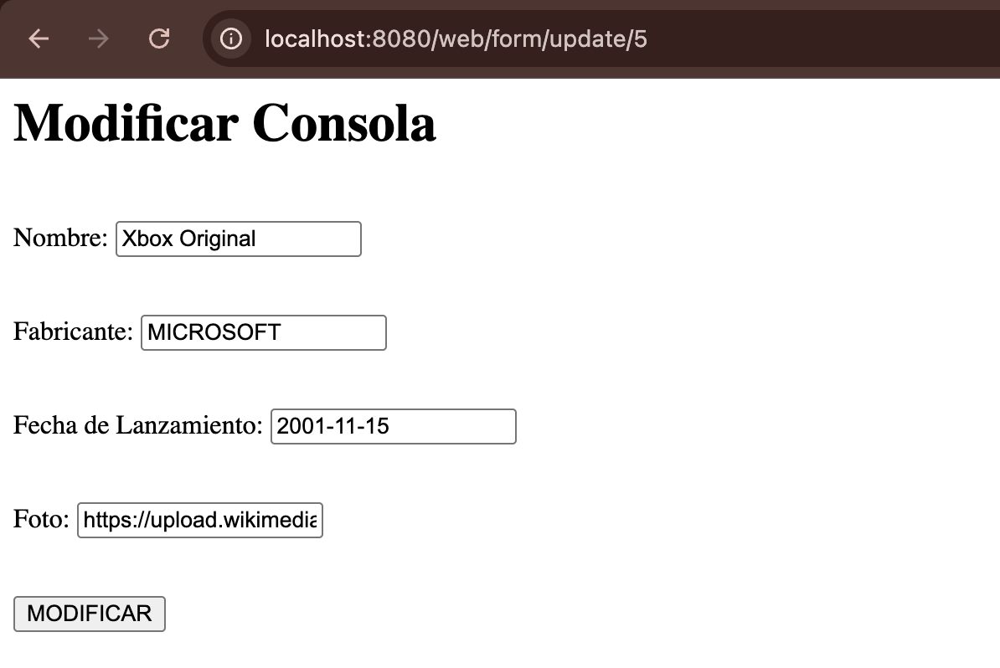
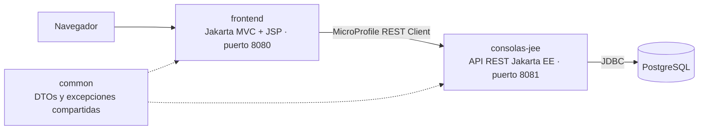

# Aplicación Web de Consolas con Jakarta EE y Jakarta MVC

Aplicación web completa para gestionar un catálogo de consolas retro (consultar, añadir, modificar y eliminar), desarrollada con **Java**, **Jakarta EE**, **Jakarta MVC** y **PostgreSQL**. Está formada por una **interfaz web** y una **API REST** independientes, que se comunican entre sí mediante **MicroProfile REST Client**.



## Contexto

Desarrollé este proyecto para preparar el **examen global** de la asignatura **Desarrollo y Administración de Sistemas de Información** (DASI), de 3.º de Ingeniería Informática en la Universidad Pontificia de Salamanca (curso 2025/26).

En ese examen obtuve un **10**, y en el conjunto de la asignatura, **Matrícula de Honor**.

Es el último de tres proyectos de estudio de la asignatura, cada uno preparado para un examen:

1. [Primer parcial](https://github.com/AdrianRubioSevillano/canciones-api-quarkus): API REST con Quarkus, arquitectura hexagonal y acceso a datos con JDBC.
2. [Segundo parcial](https://github.com/AdrianRubioSevillano/coches-microservicios-jakarta-quarkus): microservicios con Jakarta EE y Quarkus, validación de datos y gestión de errores entre servicios.
3. **Examen global** (este proyecto): aplicación web completa con interfaz gráfica, formularios protegidos y API REST.

## Tecnologías

| Área | Tecnología |
|---|---|
| Lenguaje | Java 21 |
| API REST | Jakarta EE (JAX-RS, CDI, Bean Validation) |
| Interfaz web | Jakarta MVC con vistas JSP y JSTL |
| Servidor de aplicaciones | Payara Micro 7 |
| Comunicación entre servicios | MicroProfile REST Client y MicroProfile Config |
| Base de datos | PostgreSQL 18 |
| Acceso a datos | JDBC con `PreparedStatement` y `@DataSourceDefinition` |
| Contenedores | Docker y Docker Compose |
| Conversión entre capas | MapStruct |
| Reducción de código repetitivo | Lombok |
| Gestión del proyecto | Maven (proyecto multimódulo) |

## Funcionalidades

- **Listado** de todas las consolas con su foto, ordenadas de la más reciente a la más antigua.
- **Ficha de detalle** de cada consola.
- **Formularios** para añadir, modificar y eliminar consolas.
- **Validación de los datos** tanto en el formulario como en la API. Si algún dato no es válido, el formulario se vuelve a mostrar con los mensajes de error junto a cada campo.
- **Protección CSRF** en todos los formularios, para impedir que otra web envíe peticiones en nombre del usuario.
- **Patrón POST-Redirect-GET**: tras guardar un cambio, la aplicación redirige a otra página, de forma que recargar el navegador no repite el envío.
- **Formularios HTML que envían PUT y DELETE**, mediante un campo oculto que indica el método real.

| Ficha de detalle | Formulario de modificación |
|---|---|
|  |  |

## Arquitectura

El sistema está formado por dos aplicaciones y un módulo compartido:



| Módulo | Qué hace |
|---|---|
| `frontend` | La aplicación web que ve el usuario. Muestra las páginas, recoge y valida los formularios, y pide los datos a la API |
| `consolas-jee` | La API REST. Valida los datos recibidos y accede a PostgreSQL |
| `common` | Objetos de respuesta y excepciones que comparten las dos aplicaciones, para que ambas hablen el mismo "idioma" |

### Capas de `consolas-jee`

| Capa | Qué contiene |
|---|---|
| `adapters.rest` | Los endpoints, los objetos de entrada con sus reglas de validación y los `ExceptionMapper` que convierten los errores en respuestas HTTP |
| `application.usecases` | Un caso de uso por cada operación: buscar, insertar, actualizar, eliminar... |
| `domain` | El modelo de `Consola` y la interfaz `Repository`, que define qué operaciones existen sin decir cómo se hacen |
| `infrastructure` | El acceso a PostgreSQL con JDBC y una anotación de validación propia, `@Url`, para comprobar que las fotos son direcciones válidas |

### Capas de `frontend`

| Capa | Qué contiene |
|---|---|
| `adapters.controller` | Los controladores de Jakarta MVC, que preparan los datos de cada página y gestionan los formularios |
| `infrastructure.rest` | El cliente REST que se comunica con `consolas-jee` y traduce sus respuestas de error a excepciones propias |
| `webapp/jsps` | Las vistas JSP: listado, detalle, formulario y página de error |

## Validación de datos

Al añadir o modificar una consola se comprueban estas reglas:

| Campo | Regla |
|---|---|
| `nombre` | Obligatorio, entre 3 y 100 caracteres |
| `fabricante` | Obligatorio. Solo admite `NINTENDO`, `SONY`, `SEGA`, `MICROSOFT` o `ATARI` (la misma restricción existe también en la base de datos) |
| `fechaLanzamiento` | Obligatoria y anterior a la fecha actual |
| `foto` | Obligatoria, entre 15 y 500 caracteres y con formato de dirección web válida (validación propia con `@Url`) |

## Estructura del proyecto

```
.
├── docker-compose.yml        # Base de datos PostgreSQL en Docker
├── database.sql              # Creación de la tabla y datos de ejemplo
├── consolasRequest.http      # Peticiones de ejemplo a la API (puerto 8081)
├── docs/                     # Capturas de pantalla del README
├── common/                   # Módulo compartido
├── consolas-jee/             # API REST con Jakarta EE
└── frontend/                 # Aplicación web con Jakarta MVC
```

## Cómo ejecutarlo

### Requisitos

- Java 21 o superior
- Docker
- [Payara Micro 7](https://www.payara.fish/downloads/payara-platform-community-edition/): se descarga como un único archivo `.jar`

No hace falta instalar Maven ni PostgreSQL: el proyecto incluye Maven Wrapper y la base de datos se levanta con Docker.

### Pasos

Se necesitan tres terminales, todas abiertas en la carpeta raíz del proyecto.

**1. Clonar el repositorio**

```bash
git clone https://github.com/AdrianRubioSevillano/consolas-webapp-jakarta-mvc.git
cd consolas-webapp-jakarta-mvc
```

**2. Levantar la base de datos** (terminal 1)

```bash
docker compose up -d
```

Docker descarga PostgreSQL, crea la base de datos y ejecuta `database.sql`, que crea la tabla y añade 5 consolas de ejemplo.

**3. Compilar los tres módulos** (terminal 1)

```bash
cd consolas-jee
./mvnw -f ../pom.xml clean install
cd ..
```

Este comando compila todo el proyecto de una vez: `common`, `consolas-jee` y `frontend`. Cada aplicación queda empaquetada como `target/ROOT.war`.

**4. Arrancar la API** (terminal 2)

```bash
java -jar <ruta-a>/payara-micro-7.2026.1.jar --noCluster --port 8081 --deploy consolas-jee/target/ROOT.war
```

Sustituye `<ruta-a>` por la carpeta donde descargaste Payara Micro. Si lo tienes en `/opt/payara/micro/`, también puedes usar el script incluido: `cd consolas-jee` y después `sh consolas.sh`.

**5. Arrancar la aplicación web** (terminal 3)

```bash
java -jar <ruta-a>/payara-micro-7.2026.1.jar --noCluster --port 8080 --deploy frontend/target/ROOT.war
```

**6. Abrir la aplicación** en el navegador:

```
http://localhost:8080/web/consolas
```

**7. Apagarlo todo** cuando termines: pulsa `Ctrl+C` en las terminales 2 y 3, y ejecuta `docker compose down` en la terminal 1.

> **Nota:** si ya tienes PostgreSQL instalado en tu equipo y encendido, apágalo antes del paso 2, porque ambos usan el puerto 5432.

### Configuración

El usuario y la contraseña de la base de datos (`postgres` / `postgres`) son valores de prueba para la base de datos local que crea Docker. Para conectar la API a otra base de datos, se pueden indicar otros mediante las variables de entorno `DB_USER` y `DB_PASSWORD`, sin modificar el código.

Del mismo modo, si la API se ejecuta en otra dirección, se le puede indicar a la aplicación web con la variable de entorno `CONSOLAS_URL` (por defecto, `http://localhost:8081`).

## Páginas de la aplicación web

| Página | Dirección |
|---|---|
| Listado de consolas | `/web/consolas` |
| Ficha de una consola | `/web/consolas/{id}` |
| Formulario para añadir | `/web/form/insert` |
| Formulario para modificar | `/web/form/update/{id}` |
| Confirmación para eliminar | `/web/form/delete/{id}` |

## Endpoints de la API

| Método | Ruta | Descripción | Respuesta |
|---|---|---|---|
| `GET` | `/consolas` | Lista todas las consolas (id, nombre y foto), de la más reciente a la más antigua | `200` |
| `GET` | `/consolas/{id}` | Muestra el detalle de una consola | `200` / `404` |
| `POST` | `/consolas` | Crea una consola | `201` / `400` |
| `PUT` | `/consolas/{id}` | Modifica los datos de una consola | `204` / `400` / `404` |
| `DELETE` | `/consolas/{id}` | Elimina una consola | `204` / `404` |

### Ejemplo: crear una consola

**Petición**

```http
POST http://localhost:8081/consolas
Content-Type: application/json

{
  "nombre": "Nintendo 64",
  "fabricante": "NINTENDO",
  "fechaLanzamiento": "1996-06-23",
  "foto": "https://www.ejemplo.com/fotos/nintendo-64.jpg"
}
```

**Respuesta:** `201 Created`, con la cabecera `Location` apuntando a la nueva consola y el cuerpo:

```json
{
  "id": 6,
  "nombre": "Nintendo 64",
  "fabricante": "NINTENDO",
  "fechaLanzamiento": "1996-06-23",
  "foto": "https://www.ejemplo.com/fotos/nintendo-64.jpg"
}
```

El archivo [`consolasRequest.http`](consolasRequest.http) incluye ejemplos de todas las peticiones a la API, listos para ejecutar desde IntelliJ IDEA o desde VS Code con la extensión REST Client.

## Autor

**Adrián Rubio Sevillano**: estudiante de Ingeniería Informática en la Universidad Pontificia de Salamanca.

[LinkedIn](https://www.linkedin.com/in/adrian-rubio-sevillano)
